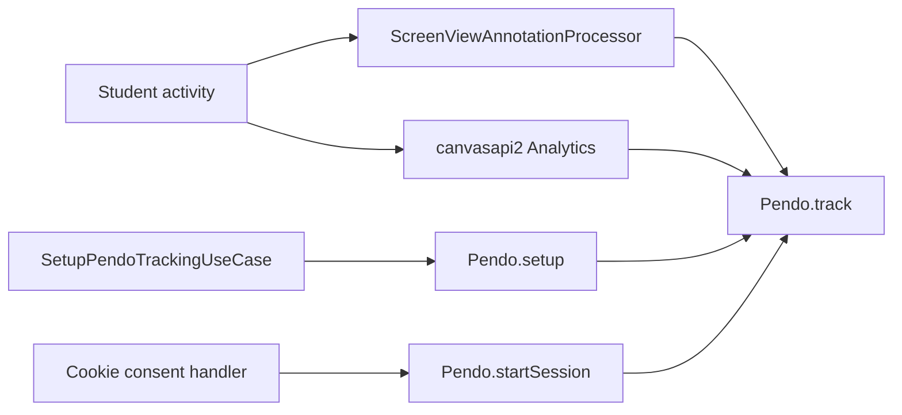
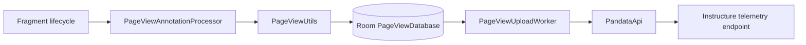

# Canvas Student Architecture & Reverse Engineering Specification

## Overview

| Attribute | Specification |
|---|---|
| **Application Name** | Canvas Student |
| **Package Name** | `com.instructure.candroid` |
| **Supported Version** | `8.10.0` (Morphe Compatibility: `8.10.0`, `minSdk` 28) |
| **Analyzed Version Code** | `297` (Derived from APK analysis; Constants specifies version string) |
| **Target SDK** | `35` (Android 15) |
| **Minimum SDK** | `28` (Android 9.0) |
| **APK Format** | APKM (`base.apk`, arm64-v8a, xhdpi splits) |
| **Package Signing SHA-256** | `abfe1362d84c5234c174c2c03d405a480405e361162f7b28dad6bec825ba02b3` |
| **Architecture** | Native Kotlin/Java; Jetpack Compose, Hilt, Room, Retrofit, WorkManager, and arm64-v8a native libraries |

Canvas Student is Instructure's Android learning-management client. The APK includes the Pendo SDK, first-party Pandata tracking, Firebase Crashlytics, and support for course content rendered through Nutrient/PSPDFKit.

## Technology Stack

- **UI and navigation**: AndroidX fragments and Jetpack Compose with Instructure's InstUI/Horizon UI packages.
- **Dependency injection**: Hilt supplies repositories, the `PageViewDao`, `PageViewUtils`, and startup use cases.
- **Networking**: Retrofit and OkHttp communicate with each Canvas institution and the separate Pandata telemetry endpoint.
- **Persistence and background work**: Room persists `PageViewEvent` records; WorkManager runs `PageViewUploadWorker`.
- **Document viewing**: Nutrient/PSPDFKit renders course documents. Its bundled analytics API is an event interface; the inspected app has no `AnalyticsClient` implementation.

### Native Runtime & 16 KB Page Compatibility (`lib/arm64-v8a/`)
Canvas Student packages three prebuilt native shared libraries for arm64-v8a:
- `libandroidx.graphics.path.so`: AndroidX graphics path rendering helper.
- `libdatastore_shared_counter.so`: Jetpack DataStore native counter mechanism.
- `libpspdfkit.so`: Nutrient/PSPDFKit native document rendering core.

On Android 15+ running in 16 KB page-size mode, the dynamic linker (`linker64`) enforces two strict constraints:
1. **16 KB ZIP Alignment:** Uncompressed `.so` entries in the APK must have their file data offsets aligned to 16,384 bytes (`offset % 16384 == 0`).
2. **Segment Alignment:** In ELF program headers, GNU RELRO (`PT_GNU_RELRO`) segments must satisfy `(p_vaddr + p_memsz) % 16384 == 0`.

In the official Canvas Student 8.10.0 APK, all three libraries have `PT_GNU_RELRO` segments that violate the segment alignment check. Even when the APK is 16 KB ZIP aligned, Android displays a system dialog warning that the application is not 16 KB page-size compatible.
## Telemetry Architecture

### Pendo Behavioral Tracking

Pendo is embedded in over 4,000 classes across `classes6.dex` through `classes8.dex`. The app-owned startup class `SetupPendoTrackingUseCase` calls `Pendo.setup(...)`; its consent path gets the current user, hashes the user's UUID, includes the account UUID and locale/survey attributes, then calls `Pendo.startSession(...)`.

`com.instructure.canvasapi2.utils.Analytics` uses `Pendo.track(...)` for app events. `ScreenViewAnnotationProcessor` converts annotated screen navigation into Pendo event names. The SDK also exposes visitor/device/account IDs, guide activities, screen-content scanning, and click analytics.

### Pandata Pageview Surveillance

`PageViewUtils.startEvent` records the current Canvas domain, URL, course/group context, student ID, masquerade ID where applicable, session ID, timestamps, and per-event duration. Events are stored through `PageViewDao` and `PageViewDatabase`. `PageViewUploadWorker` later reads queued records and uses `PandataApi` to upload them with a signed token and server-provided URL.

`OfflineAnalyticsManager` additionally logs offline course openings and duration when the user returns online. This path uses both `Analytics.logEvent` and `PageViewUtils.saveSingleEvent`.

### Diagnostic Telemetry and Prompts

`BaseAppManager.onCreate` enables Firebase Crashlytics collection. The app records exceptions from PageView processing and other UI/network paths and can set Crashlytics user IDs and custom keys. The Help screen also exposes `StudentHelpDialogFragmentBehavior.rateTheApp`, which redirects users to the Play Store.

## Patch Targets

1. **`Fix16KbPageCompatibilityPatch.kt` (`rawResourcePatch`):** Configures Morphe packaging for 16 KB ZIP alignment and edits the ELF program headers of `libandroidx.graphics.path.so`, `libdatastore_shared_counter.so`, and `libpspdfkit.so` in-place, changing non-aligned `PT_GNU_RELRO` headers to `PT_NULL` (0).
2. **`RemoveTrackingAndAnalyticsPatch.kt` (`bytecodePatch`, depends on `Fix16KbPageCompatibilityPatch`):** Preserves Pendo activity and Canvas startup lifecycles plus authenticated Pandata token retrieval, while neutralizing the Pendo core API, Pendo consent callbacks, first-party analytics and token reporting, Pandata pageview persistence/uploading, offline telemetry, Firebase Crashlytics reporting, the Help rating redirect, and `Logger.canLogUserDetails`.
