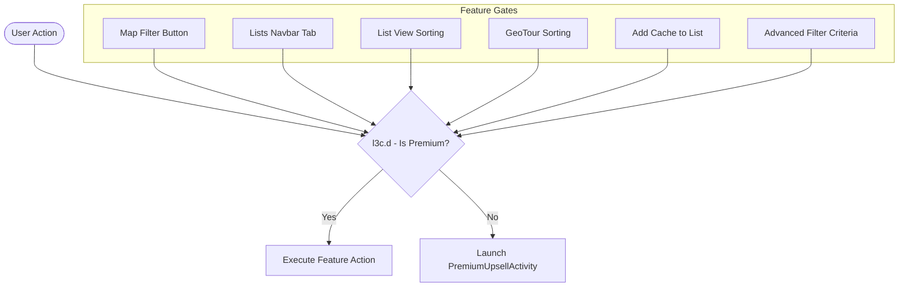

# Geocaching Architecture & Reverse Engineering Specification

## Overview

| Attribute | Specification |
|---|---|
| **Application Name** | Geocaching |
| **Package Name** | `com.groundspeak.geocaching.intro` |
| **Supported Version** | `10.21.0` (Morphe Compatibility: `10.21.0`, `minSdk` 29) |
| **Analyzed Version Code** | `1537` |
| **Target SDK** | `36` (Android 16) |
| **Minimum SDK** | `29` (Android 10) |
| **APK Format** | APKM (`base.apk`, `split_config.arm64_v8a.apk`, `split_config.en.apk`, `split_config.xxhdpi.apk`) |
| **Package Signing SHA-256** | `7f000458070a8272e5960f2b3c9d3348372f31b0e600c86af34fc06e85f8db8c` |
| **Architecture** | Native Android (Kotlin/Java); Jetpack Compose (`androidx.compose`), AndroidX Navigation, Room SQLite, Retrofit2, Google Maps SDK, MapLibre SDK |

Geocaching is Groundspeak's primary Android client for outdoor GPS geocaching. The app features map exploration, list management, offline cache packaging, trackable inventories, and social communication. While basic cache finding is permitted for free accounts, extensive features—including custom cache lists, advanced search filters (difficulty, terrain, cache size, attributes, favorite points), and sorting tools—are locked behind a Geocaching Premium subscription gate.

---

## Technology Stack & Components

- **UI Framework**: AndroidX Activities & Fragments integrated with Jetpack Compose (`androidx.compose`).
- **Main Shell**: `com.groundspeak.geocaching.intro.main.MainActivity` hosting `Navigation` graph and `BottomNavigationView`.
- **Map View Engine**: `GoogleMapFragment` and `MapLibreFragment` (`SharedMapViewModel`) rendering cache markers, trails, and attribution.
- **Lists Hub**: `com.groundspeak.geocaching.intro.listhub.ListHubFragment` (`ListHubViewModel`) managing user lists, offline bundles, and shared lists.
- **Filter Surface**: `com.groundspeak.geocaching.intro.geocachefilter.FilterScreen` (`FilterViewModel`) driving cache search filter criteria.
- **List View & Sorting**: `com.groundspeak.geocaching.intro.mainmap.listview.GeocacheListFragment` providing tabular cache lists and `SortByDialogFragment`.
- **User Session & Membership Model**: `defpackage.l3c` holding account identity, OAuth access token (`c`), and membership tier (`f`).
- **Upsell Barrier**: `com.groundspeak.geocaching.intro.premium.upsell.PremiumUpsellActivity` presenting marketing comparison flows when non-premium users access locked features.

---

## Membership Verification & Gate Architecture

User membership state is maintained in `l3c`:
- `this.f`: `1` = Basic (free), `2` = Charter Member, `3` = Premium Member.
- `l3c.d()`: Evaluates `3 == this.f || 2 == this.f`, returning `true` for Premium/Charter users and `false` for Basic users.

### 1. Map Filter Gate
In `GoogleMapFragment` (`com/groundspeak/geocaching/intro/mainmap/map/e.java`) and `MapLibreFragment` (`k.java`), clicking `menu_item_filter` queries `sharedMapViewModel.B.d()`. If false, `vr7.d` navigates to `ck4("Filter", false)`, launching `PremiumUpsellActivity`. If true, the app executes coroutine `GoogleMapFragment$onViewCreated$3$onMenuItemSelected$1` navigating to `toFiltersNavGraph`.

### 2. Lists Hub Gate
In `ListHubFragment.onViewCreated`, the fragment evaluates `!((l3c) u().J.getValue()).d()`. If non-premium, `startActivity` launches `PremiumUpsellActivity` with source `"List Hub"`. In `ListHubViewModel` (`m.java`), user premium status is also tracked in StateFlow `this.K` (`isUserPremiumFlow`), governing collaborative and offline capabilities.

### 3. List Sorting Gate
In `GeocacheListFragment` (`kb4.java`), clicking the sort header queries `sharedMapViewModel.B.d()`. If false, `vr7.d` pushes `rb4` (`ListViewToPremiumUpsellActivity(upsellSource=Sort)`). If true, `xla.Companion.a(...)` displays `SortByDialogFragment` (`"sortByDialog"`). Similarly, GeoTour sorting in `hf4.java` branches on `l3c.d()` to display `geotourSortDialog` or launch upsell.

---

## Telemetry, Analytics & Advertising Pipelines

The application integrates extensive first-party and third-party tracking pipelines:
- **First-Party Analytics**: `com.groundspeak.geocaching.intro.analytics.firebase.AnalyticsRepo`, `vm3`, `go3`, and webview interface `AnalyticsWebInterface`.
- **Firebase Analytics & Google Measurement**: `com.google.firebase.analytics.FirebaseAnalytics`, `com.google.android.gms.measurement.AppMeasurementService`.
- **Crash Reporting & Diagnostics**: `com.google.firebase.crashlytics.FirebaseCrashlytics` and internal wrapper `com.groundspeak.geocaching.intro.analytics.crashlytics.a`.
- **Performance & Messaging**: `com.google.firebase.perf.FirebasePerformance`, `com.google.firebase.inappmessaging.FirebaseInAppMessaging`.
- **Attribution & Ad Identifiers**: Google Play Advertising ID (`AdvertisingIdClient.getAdvertisingIdInfo`).
- **Facebook SDK**: `com.facebook.appevents.AppEventsLogger`, `AppEventsLoggerImpl` (`wv`), `FetchedAppSettingsManager`.
- **Marketing Automation**: `com.iterable.iterableapi.d` (`IterableApi`) handling user profiles, event dispatching, and push event tracking.
- **Usercentrics CMP**: `com.usercentrics.sdk.b`, `com.groundspeak.geocaching.intro.permissions.usercentrics.a`.
